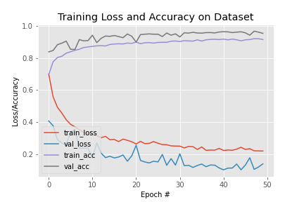

# Mask Detection using MiniVGG

## Overview

This repository implements mask detection using the MiniVGG neural network architecture. The goal is to classify images into two categories: "With Mask" and "Without Mask." The MiniVGG net consists of two sets of CONV => RELU => CONV => RELU => POOL layers, followed by a set of FC => RELU => FC => SOFTMAX layers. The architecture includes batch normalization layers after activations and dropout layers (DO) after the POOL and FC layers.

## MiniVGG Architecture

The MiniVGG architecture for mask detection is defined as follows:

- **Input Layer**: Accepts input images for mask detection.
- **Convolutional Layer 1**: 32 filters of size 3x3, followed by ReLU activation.
- **Convolutional Layer 2**: 32 filters of size 3x3, followed by ReLU activation and max-pooling (2x2, stride 2x2).
- **Convolutional Layer 3**: 64 filters of size 3x3, followed by ReLU activation.
- **Convolutional Layer 4**: 64 filters of size 3x3, followed by ReLU activation and max-pooling (2x2, stride 2x2).
- **Fully Connected Layer 1**: 128 neurons with ReLU activation and dropout.
- **Fully Connected Layer 2**: Output layer with softmax activation (2 classes: With Mask and Without Mask).

## Installation

To set up the required environment for training and testing the MiniVGG model, follow these steps:

1. **Clone the Repository:**
   ```bash
   git clone https://github.com/AJustiago/Mask-Detection.git
   cd Mask-Detection

2. **Install Dependencies:**
    ```bash
    pip install -r requirements.txt
    ```
    This command will install all the necessary Python packages specified in the [requirements](https://github.com/AJustiago/Mask-Detection/blob/main/requirements.txt) file.

3. **Download Pre-trained Weights (Optional):
    If you have pre-trained weights for the MiniVGG model, you can download and place them in the project directory.
    ```bash
    # Example command to download pre-trained weights
    wget https://example.com/pretrained_weights.h5 -O pretrained_weights.h5
    ```
    Make sure to update the URL with the correct link to your pre-trained weights.

## Steps to Create Dataset

1. **Collect Images with Mask and Without Mask**: Gather a diverse set of images featuring individuals wearing masks and others without masks. Ensure variations in lighting conditions, angles, and backgrounds for a robust dataset.

## Training Data
[Train your Dataset Here](https://github.com/AJustiago/Mask-Detection/blob/main/train.py)

## Plot Training


## Acknowledgments
The MiniVGG architecture is inspired by the original VGGNet [1].

[1] Simonyan, K., & Zisserman, A. (2014). Very Deep Convolutional Networks for Large-Scale Image Recognition. arXiv preprint arXiv:1409.1556.
